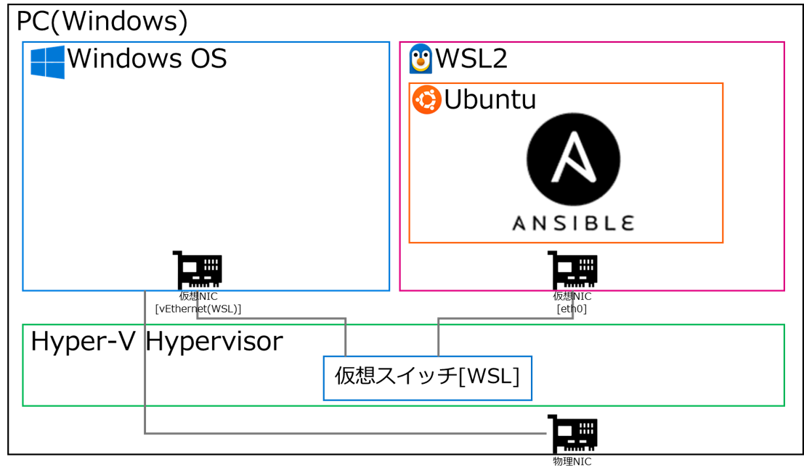
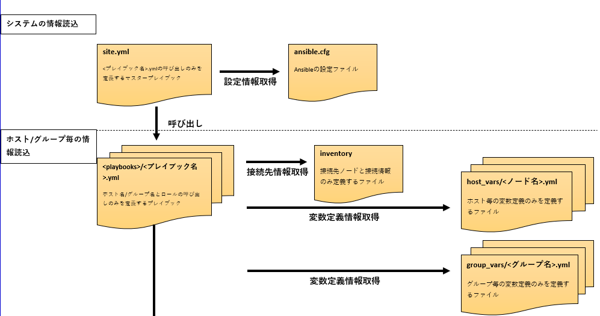
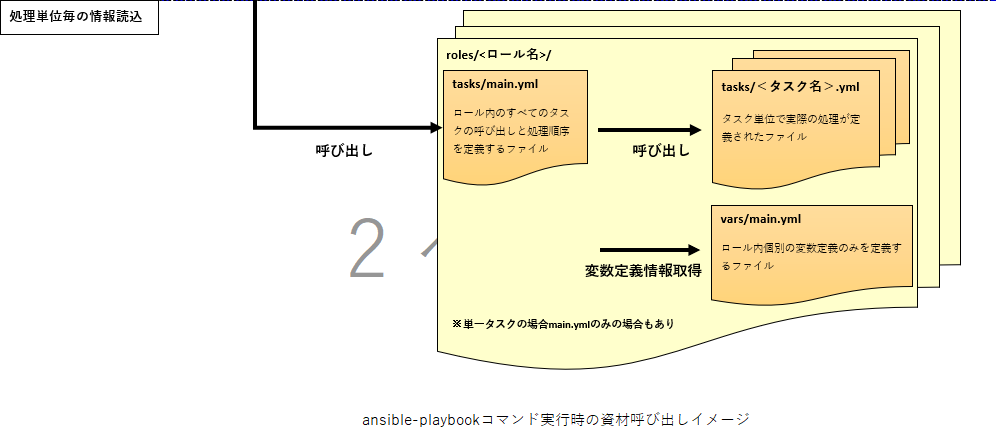

# Ansible 開発ガイドライン

## 更新履歴

|版数|変更日|変更箇所（ページ等）|変更内容|変更者|
|:-----------|:-----------|:-----------|:-----------|:-----------|
|1.0|2024.06.28|全ページ|新規作成|-|

[[_TOC_]]

# はじめに
  
本資料の位置づけや目的を説明する。
  
## 本資料の位置づけ

- 本資料は、Ansible資材を作成するためのガイドラインである。

- 共通的に利用可能なAnsible資材を作成するための指針となる。
  
## 目的

- 資材の共通化や品質の均一化のために、Ansible資材の作成方針を定義する。

- 本資料に沿ってAnsible資材を作成することで、新規に作成する場合は再利用可能な資材にする。
  
 ※本資料の公開範囲は富士通グループに限ります

# 用語集

本資料で使用する用語の意味は下記の通り。

|項番 |用語 |説明 |
|:---|:---|:---|
|1 |ノード |Ansibleによって設定変更される対象機器術 |
|2 |変数 |自動化資材（YAMLファイル）の中で変数化された値 |
|3 |YAML |Ansibleの設定ファイルで用いるテキストのデータ形式の名称 |
|4 |プレイブック/playbook |ノードに実施する処理、変数等の情報をYAMLで記述したファイル |
|5 |ロール |プレイブックを分割するためのコンポーネント |
|6 |タスク |実行したい処理の内容 |
|7 |テンプレート |変数を使って動的にファイルを生成するためのjinja2形式の雛形ファイル |
|8 |ハンドラー |Notifyで呼び出されたときにのみに実行する処理の内容 |
|9 |インベントリ/inventory |主にAnsibleから制御する対象のノード情報及び環境変数を定義するファイル |
|10 |Ansibleコード |インベントリ、変数定義ファイル、タスク、プレイブック、テンプレートファイル全般 |
|11 |モジュール |プレイブックの中で利用できるコードの単位。NW機器ベンダで提供されるものもある。 |
|12 |Ansible-galaxy |モジュールの内、Ansible標準ではなく、NW機器ベンダのものはここからDLする。 |

※本資料で可変値となる単語は（<>:山括弧）を用いて表現する。
&emsp;例： <ノード名>.yml

# 前提条件

本資料を利用する上での前提となる情報を以下に示す。

## 環境条件(ソフトウェア)

**下記のソフトウェアを利用**

- Ansible-core：2.16.*

- Python：3.10.*

- Python pip3：22.0.*

※各ソフトウェアのインストール手順は別紙参照

## 環境条件(実行環境)

**下記のPC上での実行環境構築を前提とする**

- PC推奨スペック：  CPU:Core i5-1345U  
&emsp;&emsp;&emsp;&emsp;&emsp;&emsp;&emsp;&nbsp;メモリ:16GB  
&emsp;&emsp;&emsp;&emsp;&emsp;&emsp;&emsp;&nbsp;ディスク容量:10GB以上

- WindowsOS：Windows 10 バージョン 2004 以降 (ビルド 19041 以降)

- Windows Subsystem for Linux(WSL)：2.1.5.0
- Ubuntu：22.0.4

## 実行条件

- Playbookの利用に当たり検証作業にて動作確認を必ず実施すること

- Playbook実行時は他作業と輻輳しないようにすること

※同一機器への同時作業となり不整合が発生する可能性があるため

# システム構成

本資料で想定するシステム構成を以下に示す。



※PCでの構築を前提とするため、冗長構成は考慮しない。ただし、顧客環境でAnsible環境を構築する場合、必要であれば顧客要件に合わせて冗長構成を用意すること

# 命名規約

命名規則は下記の通りとする。

- マスタープレイブック名は、「site.yml」固定とする。ロールの呼び出しを行う。
- ロール定義用プレイブック名は、「<プレイブックのホームディレクトリ名>.yml」とする。
- その他ディレクトリ名、プレイブック名、ロール名、ファイル名は規約を設けない
- 使用できる文字は以下に制限する。グローバルメンバも利用するため、マルチバイト文字は禁止とする。
  
&emsp;&emsp;&emsp;・アルファベット（A〜Z，a〜z）  
&emsp;&emsp;&emsp;・数字（0〜9）  
&emsp;&emsp;&emsp;・アンダースコア（_）、ハイフン（-）、ドット（.）

&emsp;&emsp;&emsp;使用できない文字の例) ひらがな、漢字、半角カタカナ、全角/半角スペース、等
&emsp;&emsp;&emsp;※マルチバイトを避けることで、意図しない文字化けなどを防ぐ

（例）
- ”051_check_vrrp_stats.yml”などスネークケースを推奨。  
  　定期作業の場合、作業番号などをファイル名の頭に付与すると管理しやすい。

# ヘッダ記載ルール

playbookヘッダの記載内容について定義する。

## playbookヘッダ

- playbookの説明をファイル冒頭にコメントとして記載する。
- 冒頭4行のファイル名、コピーライト、更新日時、準拠ガイドライン版数は必ず記載するようにする。  
- 以降の処理の説明は、各playbookの内容に合わせて記載する。  
  
※playbookの処理内容を把握しやすくし流用できるようにするため

|playbookヘッダ(記載例) |説明 |
|:--- |:--- |
|--- | |
|# test.yml |playbook名 |
|# COPYRIGHT 20XX FUJITSU LIMITED |コピーライトの記載 |
|# YYYY/MM/DD verX.X.X new or modified |playbook版数や更新日時の管理 |
|# Conform to Guideline verY.Y.Y |準拠するガイドライン版数 |
|################################################## | |
|## [Process Name] |処理の名前を記載する |
|##   Check interfaces status(down) | |
|## | |
|## [Summary] |処理概要を記載する |
|##   Check interfaces status of L2SW | |
|## | |
|## [Prerequisites] | |
|##   Cisco IOS XE Version 17.3 |処理の前提条件を記載する。ロールについては動作確認を行ったファームウェア情報を前提条件に記載する |
|## [Input] |入力ファイル、入力変数の一覧と、その説明を記載する。 |
|##   {{ intenface_list_to_L2 }} : Physical-IF(L2SW)<br>##   {{ intenface_list_to_L3 }} : Logical-IF(L3SW)|パラメータファイル等を入力として受け取る場合は、その構成等の説明を記載する。 |
|## | |
|## [Output] |出力ファイルの一覧と、その説明を記載する |
|##   None | |
|## | |
|################################################## | |

# コーディングルール

Ansibleコードを作成する上で守るべきルールについて、以下に示す。

## 文字コードと改行コードの統一

- 定義ファイル内の文字コードや改行コード違いによるエラーを防ぐために、以下を使用する。

|文字コード |改行コード |
|:---|:---|
|UTF-8 |LF |

## インデントの統一

- 定義ファイルの可読性が向上させるために、インデントを統一する。  
  インデントのスペース文字数は2文字を推奨する。

## ソースコードに対応するドキュメントの識別子をコメントとして記述

- 環境定義書などのドキュメントとコードの対応が明確になるため、対応するドキュメントがある場合には、ブック名、シート名、項目名などの識別子をコードのコメントとして記述する

## タスクに処理内容を示すnameを記述

- タスクの内容を明確化しAnsible実行時のログの可読性も高くするために、タスクにはタイトル情報としてnameを記述する。  
nameにタスクの処理内容が想定できるように記述すること。
- 可読性を考慮し、1 行に収まるように記載する。

nameの記述例
> -name: send show version
nxos_command:
commands: "show version"
register: nxos_results

## モジュール定義は1属性1行で記述し、属性ごとに改行する

- モジュール定義を記述する際、属性を1行で記述することも可能だが、可読性が低下する。  
属性ごとに1行で記述・改行し、複数行に分けて記述する。

## ループ処理は loop を使用する

- Ansible2.5以降、ループ処理はloopで実装することが推奨されているため、極力with_xxxではなくloopを使用するのが望ましい。※1
- loopで実現できない処理がある場合はwith_xxxを使用する。

※1 https://docs.ansible.com/ansible/latest/porting_guides/porting_guide_2.5.html#migrating-from-with-x-to-loop

# ロール作成ルール

playbooks/<プレイブック名>.ymlから呼び出す、実際のタスクなどの集合単位であるロールについて説明する。

## インターネットで公開されているロールはテスト後に利用する

- Ansibleのロールはインターネット上で公開されているものも多い。  
本資料に記載している規約に沿っているか確認し、事前に動作テストを実施した上で利用するのが望ましい。

## ロールフォルダ構成

実施するタスクが格納されているフォルダ

|フォルダ名 |説明 |
|:--- |:--- |
|defaults |変数の初期値を定義したYAMLファイルを配置するディレクトリ |
|files |ターゲットノードに転送するファイル（srcに指定するファイル）を配置するディレクトリ |
|handlers |Handlersセクションの内容を定義したYAMLファイルを配置するディレクトリ |
|meta |ロールのメタ情報やロール間の依存関係を定義したYAMLファイルを配置するディレクトリ |
|tasks |実行するタスクのYAMLファイルを配置するディレクトリ |
|templates |テンプレートモジュールを使用するYAMLファイルを配置するディレクトリ |
|vars |Role内で使用する変数（vars）を定義したYAMLファイルを格納するディレクトリ |

# タスク作成ルール

ロール内で実際の作業を記述するタスクについて、記述内容などを説明する。

## タスクの名称は作業単位にあった名称を利用

- タスクの名称は、どのような作業を定義したものか分かりやすいタスク名にする。
- タスク内容が設定ファイルの作成などの場合、近いタスク名称にすると、タスクの目的が分かりやすい。

例: タスクの単位例  
> roles/cisco/tasks/show_version.yml  
roles/cisco/tasks/inteface_down.yml  
roles/cisco/tasks/OS_versionup.yml

## タスクは標準モジュールで実装

* モジュールを利用する際には、Ansibleが冪等性を担保している標準モジュールを使用する。  
  * 同じカテゴリの作業が複数ある場合、同一のモジュールで定義する。
  * 使用できる標準モジュールは公式サイトのリファレンス※1を参照する。
* 標準のモジュールを使った実装が難しくcommandモジュール、shellモジュール、自作モジュールを利用する場合も、冪等性が担保できる実装とする。
* 「<」「>」(リダイレクト)や「|」(パイプ)等を使用する場合は、commandモジュールではなくshellモジュールを使用する。

※1 https://docs.ansible.com/ansible/latest/collections/index_module.html

## 設定ファイルは原則templateモジュールを利用

- Ansibleのテンプレートを利用することで、設定の変更が必要な設定ファイルについて、ノード毎に異なるパラメータの値を変数による穴埋めで生成できる。
- 大部分は共通しているが一部複数ノード間で異なる値の差分を持つファイルはcopyモジュールではなくtemplateモジュールを利用してテンプレート化する。

テンプレート化する手順は次の通りである。

1. テンプレートの雛形となるファイルを取得する。
2. テンプレート名となるファイル名を命名し、末尾に.j2の拡張子を付与する
3. 変数とすべき設定値の箇所を変数名に置換する。

1の設定ファイル例(httpd.conf)
> （中略）  
> Timeout 30  
> （中略）

1のファイルに2,3を適用した例(httpd.conf.j2)
> （中略）  
> Timeout {{ httpd_conf_timeout }}  
> （中略）

## ロール内の全てのタスク呼び出しを定義するtasks/main.ymlを作成

- ロール内の全てのタスクファイルを総合的に呼び出す定義をmain.yml内で記載することで、main.ymlの内容を確認するだけでロール内のタスクを一覧でき、その実行順序も定義できるようになる。

main.ymlの記述例

> - import_tasks: show_version.yml
> - import_tasks: inteface_down.yml  
> - import_tasks: OS_versionup.yml

# ディレクトリ構成

コマンドラインからansible-playbookコマンドを使用してプレイブックを実行する際、Ansibleのディレクトリや資材の構成は、Ansible公式のベストプラクティスに沿って、下記ディレクトリ構成を採用する。※１

```
.
＜playbooks＞/ (1)
├── site.yml (2)
├── ansible.cfg (3)
├── inventory (4)
├── <プレイブック名>.yml (5)
├── host_vars (6)
│   └──<ノード名>.yml (7)
├── group_vars (8)
│   └──<グループ名>.yml (9)
├── roles (10)
│   ├── <ロール名>/ 
│   ├── vars/ 
│   │   └── main.yml
│   ├── tasks/
│   │   ├── main.yml
│   │   └── <タスク名>.yml
│   ├──handlers/
│   │   └── main.yml
│   ├── templates/
│   │   └── <テンプレート名>.j2
│   ├── files/
│   │   └── <ファイル名>
│   ├── defaults/
│   │   └── main.yml
│   └── meta/
        └── main.yml
```

1. ＜playbooks＞/  
   プレイブックのホームディレクトリ（任意の名前）
2. site.yml  
   マスタープレイブック。ファイル名は「site.yml」とする。ロール定義用プレイブックを読み込む、必ず呼び出すプレイブック。
3. ansible.cfg  
   Ansibleのベース設定ファイル（Linuxで言うところのhttpd.confファイルのようなイメージ）
4. inventory  
   管理対象のノードを定義するインベントリファイル
5. <プレイブック名>.yml  
   ロール定義用プレイブック。必要なロールを指定し呼び出すプレイブック
6. host_vars  
   変数定義ファイル<host名>.ymlを配置するディレクトリ
7. <ノード名>.yml  
   ノード個別変数定義ファイル
8. group_vars  
   ノード共通で指定する変数定義ファイルの配置ディレクトリ
9. <グループ名>.yml  
    ノード共通変数定義ファイル
10. roles  
    ロール配置用ルートディレクトリ
    1. <ロール名>/
    個別ロール用ディレクトリ
    2. vars/
    Role内で使用する変数を記載したファイルを配置するディレクトリ
    3. main.yml
    変数定義ファイル
    4. tasks/
    タスク処理を記載したファイルを配置するディレクトリ
    5. main.yml
    全タスク呼び出し定義ファイル
    6. <タスク名>.yml
    作業単位のタスクを定義したファイル
    7. handlers/
    ハンドラーを記載したファイルを配置するディレクトリ
    8. main.yml
    ハンドラー定義ファイル
    9. templates/
    テンプレートファイルを配置するディレクトリ
    10. <テンプレート名>.j2
    テンプレート定義ファイル
    11. files/
    ファイル配置のルートディレクトリ
    12. <ファイル名>
    配布するファイルの配置ディレクトリ
    13. defaults/
    デフォルト値を記載したファイルを配置するディレクトリ
    14. main.yml
    ロール内での変数のデフォルト値を記載したファイル
    15. meta/
    ロールに対するメタ情報を配置するディレクトリ
    16. main.yml
    ロール内でのメタデータを記載したファイル

※1 [https://docs.ansible.com/ansible/latest/tips_tricks/sample_setup.html](https://docs.ansible.com/ansible/latest/tips_tricks/sample_setup.html)

上記の資材構成でマスタープレイブックを適用するコマンド  
> ansible-playbook -i inventory site.yml

を実行すると、以下のように、階層的に資材の呼び出しが行われる。




# システムの情報読込_site.yml

マスタプレイブックの記載内容について定義する

## site.yml

- マスタープレイブック(site.yml)からplaybookを呼び出す場合は、playbookを呼び出す定義のみ記述する  
  
※site.ymlにも変数定義や処理を記述することもできるが、変数定義はhost_vars/<ノード名>.ymlに、処理はrolesに集約し、本ファイルには<playbooks>/<プレイブック名>.ymlファイルの呼び出し定義のみを記述することで、ファイルの役割が直感的に分かりやすくなり、可読性も高くなる。

|site.yml(記載例) |説明 |
|:--- |:--- |
|- import_playbook: test1.yml |読み込むPlaybookを指定 |
|- import_playbook: test2.yml |読み込むPlaybookを指定 |
|- import_playbook: test3.yml |読み込むPlaybookを指定 |
|- import_playbook: test4.yml |読み込むPlaybookを指定 |

# システムの情報読込_ansible.cfg

ansible.cfgの記載内容について定義する

## ansible.cfg

- Ansibleのベース設定ファイル（Linuxで言うところのhttpd.confファイルのようなイメージ）

|ansible.cfg(記載例) |説明 |
|:--- |:--- |
|[defaults] | |
|-- | |
|# plays will gather facts by default, which contain information about the remote system. | |
|# | |
|# smart - gather by default, but don't regather if already gathered | |
|# implicit - gather by default, turn off with gather_facts: False| |
|# explicit - do not gather by default, must say gather_facts: True | |
|gathering = smart |ターゲットノードの詳細情報取得に関する設定、smart＝新規接続の場合情報を取得 |
|-- | |
|# some hardware related facts are collected with a maximum timeout of 10 seconds. | |
|# This option lets you increase or decrease that timeout to something more suitable for the environment. | |
|gather_timeout = 300 |ターゲットノードからの情報を収集する場合のタイムアウト時間 |
|-- | |
|# uncomment this to disable SSH key host checking | |
|host_key_checking = False |ターゲットノードにSSH接続する際の公開鍵をチェックするかどうか。|
|-- | |
|# SSH timeout | |
|timeout = 300 |SSHのタイムアウト時間 |
|-- | |
|# logging is off by default unless this path is defined | |
|# if so defined, consider logrotate | |
|# log_path = /var/log/ansible.log | |
|log_path = <playbooks>/log/ansible.log |ログのパスを定義 |
|-- | |
|# (as of 1.8), Ansible can optionally warn when usage of the shell and | |
|# command module appear to be simplified by using a default Ansible module | |
|# instead.  These warnings can be silenced by adjusting the following | |
|# setting or adding warn=yes or warn=no to the end of the command line | |
|# parameter string.  This will for example suggest using the git module | |
|# instead of shelling out to the git command. | |
|command_warnings = False |コマンドモジュールで指定したコマンドが、すでにモジュールとして存在している場合に警告を出すかどうかの設定 |
|-- | |
|[inventory] | |
|-- | |
|[privilege_escalation] | |
|-- | |
|[paramiko_connection] | |
|-- | |
|# paramiko will default to looking for SSH keys initially when trying to | |
|# authenticate to remote devices.  This is a problem for some network devices | |
|# that close the connection after a key failure.  Uncomment this line to | |
|# disable the Paramiko look for keys function | |
|look_for_keys = False |ターゲットノードに公開鍵を登録するかどうか。 |
|-- | |
|# When using persistent connections with Paramiko, the connection runs in a | |
|# background process.  If the host doesn't already have a valid SSH key, by | |
|# default Ansible will prompt to add the host key.  This will cause connections | |
|# running in background processes to fail.  Uncomment this line to have | |
|# Paramiko automatically add host keys. | |
|host_key_auto_add = True |ホストが公開鍵を持たない場合、自動で登録するかどうか。 |
|-- | |
|[connection] | |
|-- | |
|# ssh arguments to use | |
|# Leaving off ControlPersist will result in poor performance, so use | |
|# paramiko on older platforms rather than removing it, -C controls compression use | |
|#ssh_args = -C -o ControlMaster=auto -o ControlPersist=60s | |
|ssh_args = -o ControlMaster=auto -o StrictHostKeyChecking=no -o UserKnownHostsFile=/dev/null |SSHの引数を指定 |
|-- | |
|[persistent_connection] | |
|-- | |
|[accelerate] | |
|-- | |
|[selinux] | |
|-- | |
|[colors] | |
|-- | |
|[diff] | |

# ホスト・グループ毎の情報読込_inventory

inventoryの記載内容について定義する

Ancibleで管理、配布する設定ファイルのパラメータ設計において、デフォルト値、又は変更の可能性があるものについては、変数化することで資材の再利用性が向上する。変数化を検討すべきパラメータの例を以下に挙げる。

**例: ノードごとに値が異なるパラメータ**  
> ホスト名、IPアドレスなど

変数定義ファイル名がインベントリに定義されたノード名と一致する場合、Ansibleが自動で読み込みを行う。  
そのためhost_vars/<ノード名>.ymlとすることを推奨する。  
なお、inventoryファイルにグループを定義した場合、グループ固有の変数があれば、同様にgroup_vars/<グループ名>.ymlとして定義する。

## inventory
対象機器が一覧で記載されているファイル

|inventory(記載例) |説明 |
|:--- |:--- |
|[IOS_XE] |グループ名、以下に記載するホストをまとめるグループ |
|AAA-SW ansible_host=xxx.xxx.xxx.xxx |グループに所属させるホスト名。ターゲットノードにSSHでログインするための情報を記載（ホスト名、IPアドレス） |
|&emsp; | |
|[IOS_XE:vars] |グループ名内のすべてのデバイスに適用される変数定義 |
|ansible_user=root |ターゲットノードにSSHでログインするための情報を記載（ユーザ名） |
|ansible_password=password |ターゲットノードにSSHでログインするための情報を記載（パスワード） |
|ansible_port=22 |ターゲットノードにSSHでログインするための情報を記載（ポート番号） |
|ansible_network_os=ios |ターゲットノードのファームウェア情報 |
|ansible_connection=network_cli |ターゲットノードに接続するために使用する接続タイプの指定 |
|ansible_become=yes |ターゲットノードで特権コマンドを実行するために、特権モードに昇格する必要があるかどうかの指定 |
|ansible_become_method=enable |ターゲットノードで特権モードに昇格するために使用する特権モードの昇格方法の指定 |
|ansible_become_password=password |ターゲットノードで特権モードに昇格するために必要なパスワードの指定 |

# ホスト・グループ毎の情報読込_<プレイブック名>.yml

<プレイブック名>.ymlの記載内容について定義する

## <プレイブック名>.yml

対象ホストを指定し、必要なロールを指定し呼び出すプレイブック。  
各処理に合わせて必要なロールを定義する必要がある。

|<プレイブック名>.yml(記載例) |説明 |
|:--- |:--- |
|--- | |
|- hosts: AAA-SW |ターゲットノード、値は「inventory」で定義済み |
|&emsp;gather_facts: false |対象ホストの情報を取得するコマンド(無効) |
|&emsp; roles: |実行するロール（タスク）を実行順に記載 |
|&emsp;&emsp;&emsp;- close_ports |ポート閉塞を行うロールの指定 |

# ホスト・グループ毎の情報読込_host_vars

host_varsの記載内容について定義する

## host_vars

対象ホスト機器ごとに指定する値をまとめたフォルダ（<ノード名>.ymlというファイルが格納されている。）
ロール等で変数参照されるものを定義するため、各playbookに合わせて必要なパラメータを定義する必要がある。

|host_vars配下yml(記載例) |説明 |
|:--- |:--- |
|--- | |
|ports_to_close: |【変数】閉塞ポートを設定 |
|&emsp; - GigabitEthernet0/0/0 |GigabitEthernet0/0/0を閉塞対象として指定 |
|&emsp; - GigabitEthernet0/0/2 |GigabitEthernet0/0/2を閉塞対象として指定 |

# ホスト・グループ毎の情報読込_group_vars

group_varsの記載内容について定義する

## group_vars

対象ホストで共通に指定する値をまとめたフォルダ（<グループ名>.ymlというファイルが格納されている。）  
ロール等で変数参照されるものを定義するため、各playbookに合わせて必要なパラメータを定義する必要がある。

|group_vars配下yml(記載例) |説明 |
|:--- |:--- |
|<all.yml> | |
|--- | |
|provider: |認証情報を指定する |
|&emsp;user: test01 |bigipログインユーザ名 |
|&emsp;password: password |bigipパスワード |
|&emsp;server: "{{ ansible_host }}" |接続するサーバ情報（今回は対象BIGIP）値はinventory.iniで定義済 |
|&emsp;server_port: 443 |接続ポート |
|&emsp;validate_certs: no |証明書の検証の有無 |
|&emsp; | |
|filepath: ../logs/{{ lookup('pipe', 'date +%Y%m%d') }}_conf |ログを保存するファイルパスとファイル名を指定  "logs"配下に「日付_conf」フォルダを作成 |
|&emsp; | |
|ping_dest: |【変数】Pingの送信先を指定 |
|&emsp;- dest_ip: 10.100.100.9 |Pingの送信先 |
|&emsp;&emsp;rd: 0 |RouteDomainのID |
|&emsp; | |
|ftpserver: 192.168.1.130 |作成したバックアップファイルを送信する宛先（ftpサーバ）を指定 |
|ftpuser: test |ftpサーバのユーザ名 |
|ftppass: ftppassword |ftpサーバのパスワード |
|&emsp; | |
|vlans_add: true |【フラグ】true=実行、false=実行しない |
|vlans: |【変数】VLANを設定 |
|&emsp;- name: VL_external_2448 |名前 |
|&emsp;&emsp;tag: 2448 |VLAN番号 |
|&emsp;&emsp;phy_int: 5.0 |インターフェース番号 |
|&emsp; | |
|&emsp;- name: VL_external_2548 |名前 |
|&emsp;&emsp;tag: 2548 |VLAN番号 |
|&emsp;&emsp;phy_int: 6.0 |インターフェース番号 |
|&emsp; | |
|route_domain_add: true |【フラグ】true=実行、false=実行しない |
|route_domain: |【変数】RouteDomainを設定 |
|&emsp;- name: fw-abcde |名前 |
|&emsp;&emsp;id: 49 |ID |
|&emsp;&emsp;vlan: |所属するVLAN |
|&emsp;&emsp;&emsp;- VL_external_2448 |所属するVLAN |
|&emsp;&emsp;&emsp;- VL_external_2548 |所属するVLAN |
|&emsp; | |
|self_fips_add: true |【フラグ】true=実行、false=実行しない |
|self_fips: |【変数】Floating IPを設定 |
|&emsp;- name: 10.0.0.6%49 |名前 |
|&emsp;&emsp;id: 49 |RouteDomainのID |
|&emsp;&emsp;address: 10.0.0.6 |Floating IP |
|&emsp;&emsp;netmask: 255.255.255.248 |サブネットマスク |
|&emsp;&emsp;service: none |Port Lockdownの値 |
|&emsp;&emsp;vlan: VL_external_2448 |VLAN番号 |
|&emsp; | |
|&emsp;- name: 10.10.10.14%49 |名前 |
|&emsp;&emsp;id: 49 |RouteDomainのID |
|&emsp;&emsp;address: 10.10.10.14 |Floating IP |
|&emsp;&emsp;netmask: 255.255.255.248 |サブネットマスク |
|&emsp;&emsp;service: none |Port Lockdownの値 |
|&emsp;&emsp;vlan: VL_external_2548 |VLAN番号 |
|&emsp; | |
|static_route_add: true |【フラグ】true=実行、false=実行しない |
|&emsp; | |
|pool_add: true |【フラグ】true=実行、false=実行しない |
|pool: |【変数】Poolを設定 |
|&emsp;- name: pool_10.10.10.1_rd49 |名前 |
|&emsp;&emsp;lb_method: round-robin |負荷分散方式 |
|&emsp;&emsp;monitors: gateway_icmp |ヘルスモニター |
|&emsp; | |
|node_add: true |【フラグ】true=実行、false=実行しない |
|node: |【変数】Nodeを設定 |
|&emsp;- name: 10.0.0.9%49 |名前 |
|&emsp;&emsp;address: 10.0.0.9%49 |Nodeの実IPアドレス |
|&emsp; | |
|pool_member: |【変数】Poolに追加するNodeを設定 |
|&emsp;- name: 10.0.0.9%49 |名前 |
|&emsp;&emsp;address: 10.0.0.9%49 |Nodeの実IPアドレス |
|&emsp;&emsp;pool: pool_10.10.10.1_rd49 |追加するPool |
|&emsp;&emsp;port: 0 |ポート番号 |
|&emsp; | |
|snat_pool_add: true |【フラグ】true=実行、false=実行しない |
|snat_pool: |【変数】Snat Poolを設定 |
|&emsp;- name: snat_10.255.10.1_rd49 |名前 |
|&emsp;&emsp;member: 10.255.10.1%49 |メンバー |
|&emsp; | |
|&emsp;- name: snat_10.255.10.2_rd49 |名前 |
|&emsp;&emsp;member: 10.255.10.2%49 |メンバー |
|&emsp; | |
|&emsp;- name: snat_10.255.10.3_rd49 |名前 |
|&emsp;&emsp;member: 10.255.10.3%49 |メンバー |
|&emsp; | |
|data_group_add: true |【フラグ】true=実行、false=実行しない |
|data_group: |【変数】Data groupを設定 |
|&emsp;- name: snat_10.10.10.17_class_rd49 |名前 |
|&emsp;&emsp;key: 10.10.10.17%49 |Address Recordsに登録するIPアドレス |
|&emsp;&emsp;type: ip |タイプ |
|&emsp; | |
|&emsp;- name: snat_10.10.10.18_class_rd49 |名前 |
|&emsp;&emsp;key: 10.10.10.18%49 |Address Recordsに登録するIPアドレス |
|&emsp;&emsp;type: ip |タイプ |
|&emsp; | |
|&emsp;- name: snat_10.10.10.19_class_rd49 |名前 |
|&emsp;&emsp;key: 10.10.10.19%49 |Address Recordsに登録するIPアドレス |
|&emsp;&emsp;type: ip |タイプ |
|&emsp; | |
|irule_add: true |【フラグ】true=実行、false=実行しない |
|irule: |【変数】iRuleを設定 |
|&emsp;- name: vip_10.10.10.1_rd49_irule |名前 |
|&emsp;src: roles/fw_irule_set/files/vip_10.10.10.1_rd49_irule.tcl |読み込むtclファイルを指定 |
|&emsp; | |
|rule_list_add: true |【フラグ】true=実行、false=実行しない |
|rule_list: |【変数】Rule listを設定 |
|&emsp;- name: vip_10.10.10.1_rd49_rulelist |名前 |
|&emsp;- name: all_deny_rulelist |名前 |
|&emsp; | |
|policy_add: true |【フラグ】true=実行、false=実行しない |
|policy: |【変数】Policyを設定 |
|&emsp;- name: vip_10.10.10.1_rd49_policy |名前 |
|&emsp; | |
|tcp_udp_rule_add: true |【フラグ】true=実行、false=実行しない |
|tcp_udp_rule: |【変数】TCP/UDP ruleを設定 |
|&emsp; - name: vip_10.10.10.1_rd49_tcp_in_rule_001 |名前 |
|&emsp;&emsp;parent: vip_10.10.10.1_rd49_rulelist |ポリシーを設定するRule list |
|&emsp;&emsp;proto: tcp |プロトコル |
|&emsp;&emsp;action: accept |実行するアクション |
|&emsp; | |
|&emsp; - name: vip_10.10.10.1_rd49_tcp_in_rule_002 |名前 |
|&emsp;&emsp;parent: vip_10.10.10.1_rd49_rulelist |ポリシーを設定するRule list |
|&emsp;&emsp;proto: tcp |プロトコル |
|&emsp;&emsp;action: accept |実行するアクション |
|&emsp; | |
|&emsp; - name: vip_10.10.10.1_rd49_tcp_in_rule_003 |名前 |
|&emsp;&emsp;parent: vip_10.10.10.1_rd49_rulelist |ポリシーを設定するRule list |
|&emsp;&emsp;proto: tcp |プロトコル |
|&emsp;&emsp;action: accept |実行するアクション |
|&emsp; | |
|add_source_addr_tcp_udp: |【変数】送信元ruleを設定 |
|&emsp;- name: vip_10.10.10.1_rd49_tcp_in_rule_001 |名前 |
|&emsp;&emsp;parent: vip_10.10.10.1_rd49_rulelist |ポリシーを設定するRule list |
|&emsp;&emsp;source_addr: 10.10.10.17 |送信元アドレス |
|&emsp; | |
|&emsp;- name: vip_10.10.10.1_rd49_tcp_in_rule_002 |名前 |
|&emsp;&emsp;parent: vip_10.10.10.1_rd49_rulelist |ポリシーを設定するRule list |
|&emsp;&emsp;source_addr: 10.10.10.18 |送信元アドレス |
|&emsp; | |
|add_destination_addr_tcp_udp: |【変数】宛先ruleを設定 |
|&emsp;- name: vip_10.10.10.1_rd49_tcp_in_rule_001 |名前 |
|&emsp;&epsp;parent: vip_10.10.10.1_rd49_rulelist |ポリシーを設定するRule list |
|&emsp;&emsp;destination_addr: 10.10.10.1 |宛先アドレス |
|&emsp; | |
|&emsp;- name: vip_10.10.10.1_rd49_tcp_in_rule_002 |名前 |
|&emsp;&epsp;parent: vip_10.10.10.1_rd49_rulelist |ポリシーを設定するRule list |
|&emsp;&emsp;destination_addr: 10.10.10.1 |宛先アドレス |
|&emsp; | |
|add_destination_port_tcp_udp: |【変数】宛先port ruleを設定 |
|&emsp;- name: vip_10.10.10.1_rd49_tcp_in_rule_001 |名前 |
|&emsp;&epsp;parent: vip_10.10.10.1_rd49_rulelist |ポリシーを設定するRule list |
|&emsp;&emsp;destination_port: 22 |宛先ポート |
|&emsp; | |
|&emsp;- name: vip_10.10.10.1_rd49_tcp_in_rule_002 |名前 |
|&emsp;&epsp;parent: vip_10.10.10.1_rd49_rulelist |ポリシーを設定するRule list |
|&emsp;&emsp;destination_port: 22 |宛先ポート |
|&emsp; | |
|icmp_rule_add: true |【フラグ】true=実行、false=実行しない |
|icmp_rule: |【変数】ICMP ruleを設定 |
|&emsp;- name: vip_10.10.10.1_rd49_icmp_in_rule_001 |名前 |
|&emsp;&emsp;parent: vip_10.10.10.1_rd49_rulelist |ポリシーを設定するRule list |
|&emsp;&emsp;proto: icmp |プロトコル |
|&emsp;&emsp;action: accept |実行アクション |
|&emsp; | |
|&emsp;- name: vip_10.10.10.1_rd49_icmp_in_rule_002 |名前 |
|&emsp;&emsp;parent: vip_10.10.10.1_rd49_rulelist |ポリシーを設定するRule list |
|&emsp;&emsp;proto: icmp |プロトコル |
|&emsp;&emsp;action: accept |実行アクション |
|&emsp; | |
|add_source_addr_icmp: |【変数】送信元ruleを設定 |
|&emsp;- name: vip_10.10.10.1_rd49_icmp_in_rule_001 |名前 |
|&emsp;&emsp;parent: vip_10.10.10.1_rd49_rulelist |ポリシーを設定するRule list |
|&emsp;&emsp;source_addr: 10.10.10.17 |送信元アドレス |
|&emsp; | |
|&emsp;- name: vip_10.10.10.1_rd49_icmp_in_rule_002 |名前 |
|&emsp;&emsp;parent: vip_10.10.10.1_rd49_rulelist |ポリシーを設定するRule list |
|&emsp;&emsp;source_addr: 10.10.10.18 |送信元アドレス |
|&emsp; | |
|add_destination_addr_icmp: |【変数】宛先ruleを設定 |
|&emsp;- name: vip_10.10.10.1_rd49_icmp_in_rule_001 |名前 |
|&emsp;&emsp;parent: vip_10.10.10.1_rd49_rulelist |ポリシーを設定するRule list |
|&emsp;&emsp;destination_addr: 10.10.10.1 |宛先アドレス |
|&emsp; | |
|&emsp;- name: vip_10.10.10.1_rd49_icmp_in_rule_002 |名前 |
|&emsp;&emsp;parent: vip_10.10.10.1_rd49_rulelist |ポリシーを設定するRule list |
|&emsp;&emsp;destination_addr: 10.10.10.1 |宛先アドレス |
|&emsp; | |
|add_type_icmp: |【変数】宛先port ruleを設定 |
|&emsp;- name: vip_10.10.10.1_rd49_icmp_in_rule_001 |名前 |
|&emsp;&emsp;parent: vip_10.10.10.1_rd49_rulelist |ポリシーを設定するRule list |
|&emsp;&emsp;type: 0 |ICMP Message Type |
|&emsp; | |
|&emsp;- name: vip_10.10.10.1_rd49_icmp_in_rule_001 |名前 |
|&emsp;&emsp;parent: vip_10.10.10.1_rd49_rulelist |ポリシーを設定するRule list |
|&emsp;&emsp;type: 8 |ICMP Message Type |
|&emsp; | |
|&emsp;- name: vip_10.10.10.1_rd49_icmp_in_rule_002 |名前 |
|&emsp;&emsp;parent: vip_10.10.10.1_rd49_rulelist |ポリシーを設定するRule list |
|&emsp;&emsp;type: 0 |ICMP Message Type |
|&emsp; | |
|&emsp;- name: vip_10.10.10.1_rd49_icmp_in_rule_002 |名前 |
|&emsp;&emsp;parent: vip_10.10.10.1_rd49_rulelist |ポリシーを設定するRule list |
|&emsp;&emsp;type: 8 |ICMP Message Type |
|&emsp; | |
|apply_rule_list_add: true |【フラグ】true=実行、false=実行しない |
|apply_rule_list: |【変数】PolicyにRule listを設定 |
|&emsp;- policy: vip_10.10.10.1_rd49_policy |ポリシー名 |
|&emsp;&emsp;rule_list: vip_10.10.10.1_rd49_rulelist |追加するRule list |
|&emsp; | |
|&emsp;- policy: vip_10.10.10.1_rd49_policy |ポリシー名 |
|&emsp;&emsp;rule_list: all_deny_rulelist |追加するRule list |
|&emsp; | |
|virtual_server_add: true |【フラグ】true=実行、false=実行しない |
|virtual_server: |【変数】Virtual Serverを設定 |
|&emsp;- name: vip_10.10.10.1_rd49 |名前 |
|&emsp;&emsp;id: 49 |RouteDomainのID |
|&emsp;&emsp;destination: 10.10.10.1%49 |宛先アドレス |
|&emsp;&emsp;source: 0.0.0.0%49 |送信元アドレス |
|&emsp;&emsp;source_mask: 0 |送信元サブネットマスク |
|&emsp;&emsp;port: 0 |ポート番号 |
|&emsp;&emsp;pool: pool_10.10.10.1_rd49 |プール名 |
|&emsp;&emsp;profiles: |プロファイル名 |
|&emsp;&emsp;&emsp;- /Common/fastL4 |プロファイル名 |
|&emsp;&emsp;irule: /Common/vip_10.10.10.1_rd49_irule |iRule |
|&emsp;&emsp;ip_protocol: any |ip_protocol |
|&emsp;&emsp;security_log_profiles: fw-loging-pro |security_log プロファイル |
|&emsp;&emsp;enabled_vlans: |VLAN |
|&emsp;&emsp;&emsp;- all |VLAN |
|&emsp;&emsp;policy: vip_10.10.10.1_rd49_policy |Policy |
|&emsp;&emsp;snatpool: none |Snat pool |
|&emsp;&emsp;type: performance-l4 |VSのタイプ |

# 処理単位毎の情報読込_tasks

tasksの記載内容について定義する

## tasks

ロール内でのタスク処理内容を記載したフォルダ（tasks/main.ymlというファイルが格納されている。）

|tasks/main.yml(記載例) |説明 |
|:--- |:--- |
|--- | |
|# main.yml |ヘッダ記載ルール |
|# COPYRIGHT 2024 FUJITSU LIMITED |ヘッダ記載ルール |
|# 2024/06/20 ver1.0.0 new |ヘッダ記載ルール |
|# Conform to Guideline ver1.0.0 |ヘッダ記載ルール |
|################################################## |ヘッダ記載ルール |
|## [Process Name] |ヘッダ記載ルール |
|##   Interfaces Shutdown |ヘッダ記載ルール |
|## |ヘッダ記載ルール |
|## [Summary] |ヘッダ記載ルール |
|##   Interfaces Shutdown of IOS-XE |ヘッダ記載ルール |
|## |ヘッダ記載ルール |
|## [Prerequisites] |ヘッダ記載ルール |
|##   Cisco IOS XE Version 3.2 |ヘッダ記載ルール |
|## |ヘッダ記載ルール |
|## [Input] |ヘッダ記載ルール |
|##   {{ ports_to_close }} : Shutdown Target IF  |ヘッダ記載ルール |
|## |ヘッダ記載ルール |
|## [Output] |ヘッダ記載ルール |
|##   None |ヘッダ記載ルール |
|## |ヘッダ記載ルール |
|################################################## |ヘッダ記載ルール |
|--- | |
|- name: Interfaces Shutdown |タスク名 |
|&emsp;ios_interfaces: |Cisco IOS XEのインターフェースモジュールの指定 |
|&emsp;&emsp;config: |モジュールに渡す設定の指定 |
|&emsp;&emsp;&emsp;- name: "{{ item }}" |ループ内で渡されるインターフェース名の指定 |
|&emsp;&emsp;&emsp;&emsp;enabled: false |インターフェースの状態の指定(閉塞指定) |
|&emsp;&emsp;state: merged |インターフェース状態の指定項目のみ変更 |
|&emsp;loop: "{{ ports_to_close }}" |「ports_to_close」変数に含まれるすべてのインタフェースに対してタスクを実行するためのループ |
|&emsp;register: interface_status |タスクの結果を「interface_status」変数に登録 |
|--- | |
|- name: Message |タスク名 |
|&emsp;ansible.builtin.debug: |デバック情報を表示するためのモジュールの指定 |
|&emsp;msg: "Interfaces Status: {{ interface_status.results }}" |インターフェース閉塞タスクの結果を出力 |

# 変数定義の優先度

変数定義の優先度について、以下に示す。

## 変数の優先順位

下記のように変数は複数の箇所で定義可能であるが、優先順位がある。

本資料では、①varsと②host_varsと④group_varsの使用を基本とする。

※https://docs.ansible.com/ansible/latest/playbook_guide/playbooks_variables.html#variable-precedence-where-should-i-put-a-variable

|ディレクトリ名/ファイル名 |
|:---|
|< playbooks>/|
|├  site.yml |
|├  ansible.cfg |
|├  inventory |
|│ |
|├  <プレイブック名>.yml |
|│  　　　　　： |
|├  hosts　　　　　　　・・・③、⑤ |
|├─host_vars/　　　　・・・② |
|│      <ノード名>.yml |
|│      　　　　：  |
|├─group_vars/　　　　・・・④ |
|│      <グループ名>.yml |
|│      　　　　：  |
|│ |
|└─roles/ |
|&emsp;&emsp;├─<ロール名>/ |
|&emsp;&emsp;│  ├─vars/　　　　  ・・・① |
|&emsp;&emsp;│  │      main.yml |
|&emsp;&emsp;│  ├─tasks/ |
|&emsp;&emsp;│  │      main.yml |
|&emsp;&emsp;│  │      <タスク名>.yml |
|&emsp;&emsp;│  ├─handlers/ |
|&emsp;&emsp;│  │      main.yml |
|&emsp;&emsp;│  ├─templates/ |
|&emsp;&emsp;│  │      <テンプレート名>.j2 |
|&emsp;&emsp;│  │   　　　　　　　　　： |
|&emsp;&emsp;│  ├─files/ |
|&emsp;&emsp;│  │      <ファイル名> |
|&emsp;&emsp;│  │   　　　　　　　　　： |
|&emsp;&emsp;│  ├─defaults/　　　・・・⑥ |
|&emsp;&emsp;│  │      main.yml |
|&emsp;&emsp;│  ├─meta/ |
|&emsp;&emsp;│  │      main.yml |

### 優先順位：(高①←⑥低)

&emsp;**①roles/<ロール名>/vars/main.yml**

&emsp;&emsp;-> ロール内固有変数

&emsp;**②host_vars/<ノード名>.yml**

&emsp;&emsp;-> ホスト固有変数

&emsp;③hosts (hostname varname=value)

&emsp;&emsp;-> ホスト固有変数

&emsp;**④group_vars/<グループ名>.yml**

&emsp;&emsp;-> グループ固有変数

&emsp;⑤hosts ([group:vars])

&emsp;&emsp;-> グループ固有変数

&emsp;⑥roles/<ロール名>/defaults/main.ym

&emsp;&emsp;-> ロール内固有変数(変数のデフォルト値)

# 作成方針

Ansible開発する上での方針について、以下に示す。

## 冪等性の考え方

- Ansible開発において冪等性とは、ある作業を同一手順・同一資材で作業を実施する限り必ず同一の状態になることを指す。
- 基本は冪等性を担保できるように開発する事。  
ただし、パッケージインストール等により冪等性が担保できない場合がある。（state:latestでバージョン明記しない場合）  
その場合も問題なく実行できる手順/運用を検討する事。もしくは別手順(切り戻しや手作業等)を準備すること。
- shellモジュール、ios_commandモジュールなど定義したコマンドをそのまま実行する様なモジュールを利用しない。

## モジュールの使用条件

- Ansible Community Documentation※1で公開されているものは利用可とする。

※1 https://docs.ansible.com/ansible/latest/collections/index.html

## 切り戻しプレイブックの実装方針

- 初期構築：
  - 基本的に切り戻しプレイブックを作成しなくてもよい。
  - プレイブック実行失敗時は、プレイブックが冪等性を担保している事を前提として再実行する。
- 維持作業：
  - 基本的に切り戻し用プレイブックを作成する。
  - 状況に応じて切り戻しプレイブックを作成せず手動で切り戻す事も許容する。
  - blockのエラー処理、あるいはroles/handlersによりプレイブックの中で自動で切り戻すことを推奨。
  - ※blockについて：https://docs.ansible.com/ansible/2.9_ja/user_guide/playbooks_blocks.html
  - ※handlersについて：https://docs.ansible.com/ansible/latest/playbook_guide/playbooks_handlers.html

## 説明用ドキュメントの作成

- 下記のようにplaybookに対する説明資料を作成することで、資材を流用や活用できるようにする。
  - コンフィグにはymlファイル、説明にはパラメータや処理の説明を記載する。
  - コンフィグと説明が対で表現されていれば、ドキュメントの形式は問わない。
  - playbookヘッダについては、処理概要を記載しているため、説明の記載は不要とする。

|コンフィグ(記載例) |説明(記載例) |
|:---|:---|
|---| |
|# main.yml |ヘッダ記載ルール |
|# COPYRIGHT 2024 FUJITSU LIMITED |ヘッダ記載ルール |
|# 2024/06/20 ver1.0.0 new |ヘッダ記載ルール |
|# Conform to Guideline ver1.0.0 |ヘッダ記載ルール |
|################################################## |ヘッダ記載ルール |
|## [Process Name] |ヘッダ記載ルール |
|##   Interfaces Shutdown |ヘッダ記載ルール |
|## |ヘッダ記載ルール |
|## [Summary] |ヘッダ記載ルール |
|##   Interfaces Shutdown of IOS-XE |ヘッダ記載ルール |
|## |ヘッダ記載ルール |
|## [Prerequisites] |ヘッダ記載ルール |
|##   Cisco IOS XE Version 3.2 |ヘッダ記載ルール |
|## |ヘッダ記載ルール |
|## [Input] |ヘッダ記載ルール |
|##   {{ ports_to_close }} : Shutdown Target IF  |ヘッダ記載ルール |
|## |ヘッダ記載ルール |
|## [Output] |ヘッダ記載ルール |
|##   None |ヘッダ記載ルール |
|## |ヘッダ記載ルール |
|################################################## |ヘッダ記載ルール |
|&emsp; | |
|- name: Interfaces Shutdown |タスク名 |
|&emsp;ios_interfaces: |Cisco IOS XEのインタフェースモジュールの指定 |
|&emsp;&emsp;config: |モジュールに渡す設定の指定 |
|&emsp;&emsp;&emsp;- name: "{{ item }}" |ループ内で渡されるインタフェース名の指定 |
|&emsp;&emsp;&emsp;&emsp;enabled: false |インタフェースの状態の指定(閉塞指定) |
|&emsp;&emsp;state: merged |インタフェース状態の指定項目のみ変更 |
|&emsp;loop: "{{ ports_to_close }}" |「ports_to_close」変数に含まれるすべてのインタフェースに対してタスクを実行するためのループ |
|&emsp;register: interface_status |タスクの結果を「interface_status」変数に登録 |
|： |： |

# 対応製品一覧

本資料の対象とする製品は下記となる。

Ansible Community Documentation※1で公開されているもののみ対応製品とする。  
各モジュールのNoteに記載されているTested Versionを確認すること。  
※1 https://docs.ansible.com/ansible/latest/collections/index.html

代表的な対応するNW製品は下記となる。

|ベンダ名 |OS/機種 |collection名 |提供機能例 |
|:---|:---|:---|:---|
|Cisco |ACI |cisco.aci |BGP/interface/L3-out/contract/EPG/IP/HSRP/OSPF/static/config |
|Cisco |IOS/IOS-XE |cisco.ios |ACL/BGP/interface/SVI/IP/OSPF/prefix-list/route-map/static/config/command |
|Cisco |IOS-XR |cisco.iosxr |ACL/BGP/interface/IP/OSPF/prefix-list/route-map/static/config/command |
|Cisco |NX-OS |cisco.nxos |ACL/BGP/interface/IP/HSRP/OSPF/prefix-list/route-map/static/config/command |
|F5 |BIG-IP |f5networks.f5_modules |Floating IP/Routing/Virtualserver/Pool/Member/NAT/iRule/Data Group/firewall rule |
|Fortigate |FortiOS |fortinet.fortios | |
|Juniper |Junos |junipernetworks.junos | |

# サンプルロール

以降のシートにサンプルロールを記載する。

本ガイドラインで記載するサンプルロールは一部であり、サンプルコードはコードプールに格納する。  
コードプールの所在は別途ガイドラインのアップデートで通知する。

# Nexus_show

|コンフィグ(記載例) |説明(記載例) |
|:---|:---|
|--- | |
|# main.yml |ヘッダ記載ルール |
|# COPYRIGHT 2024 FUJITSU LIMITED |ヘッダ記載ルール |
|# 2024/06/20 ver1.0.0 new |ヘッダ記載ルール |
|# Conform to Guideline ver1.0.0 |ヘッダ記載ルール |
|################################################## |ヘッダ記載ルール |
|## [Process Name] |ヘッダ記載ルール |
|##   Get Version Information |ヘッダ記載ルール |
|## |ヘッダ記載ルール |
|## [Summary] |ヘッダ記載ルール |
|##   Get show version log |ヘッダ記載ルール |
|## |ヘッダ記載ルール |
|## [Prerequisites] |ヘッダ記載ルール |
|##   NX-OS 7.3(2)N1(1) |ヘッダ記載ルール |
|## |ヘッダ記載ルール |
|## [Input] |ヘッダ記載ルール |
|##   None |ヘッダ記載ルール |
|## |ヘッダ記載ルール |
|## [Output] |ヘッダ記載ルール |
|##   None |ヘッダ記載ルール |
|## |ヘッダ記載ルール |
|################################################## |ヘッダ記載ルール |
|&emsp; | |
|- name: send show version |タスク名 |
|&emsp;nxos_command: |Cisco NX-OSのコマンドモジュールの指定 |
|&emsp;&emsp;commands: "show version" |投入するコマンドの指定 |
|&emsp;register: nxos_results |コマンド出力結果を「nxos_results」変数に登録 |
|&emsp; | |
|- name: display show version |タスク名 |
|&emsp; debug: |デバッグ情報を表示するためのモジュールの指定 |
|&emsp;var: nxos_results |コマンド出力結果の出力 |
